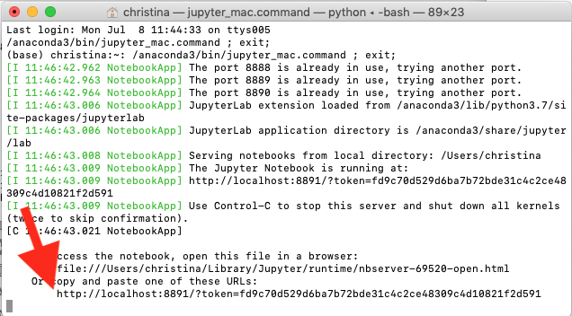
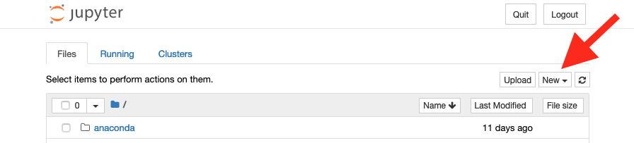
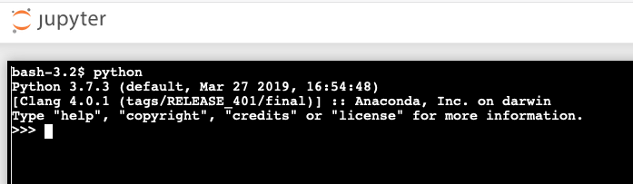

# Python Console: Mac Alternatives

Open Anaconda Navigator from Applications.  

Launch Jupyter Notebook (it should be installed, but install it if needed).

This will open a Terminal window, and then a web browser window.  If the Web browser window doesn’t open, look for a URL in the terminal, and copy and paste it into a web browser window:

When you have the web browser open, click on the New button towards the upper right:

Choose Terminal from the New menu.  This will open a terminal window in your browser in a new tab.  At the prompt (which will likely be something like `bash-3.2$`) type `python`.  Then in the initial text, it should indicate Python 3.7 as the version and you should get a `>>>` prompt.

