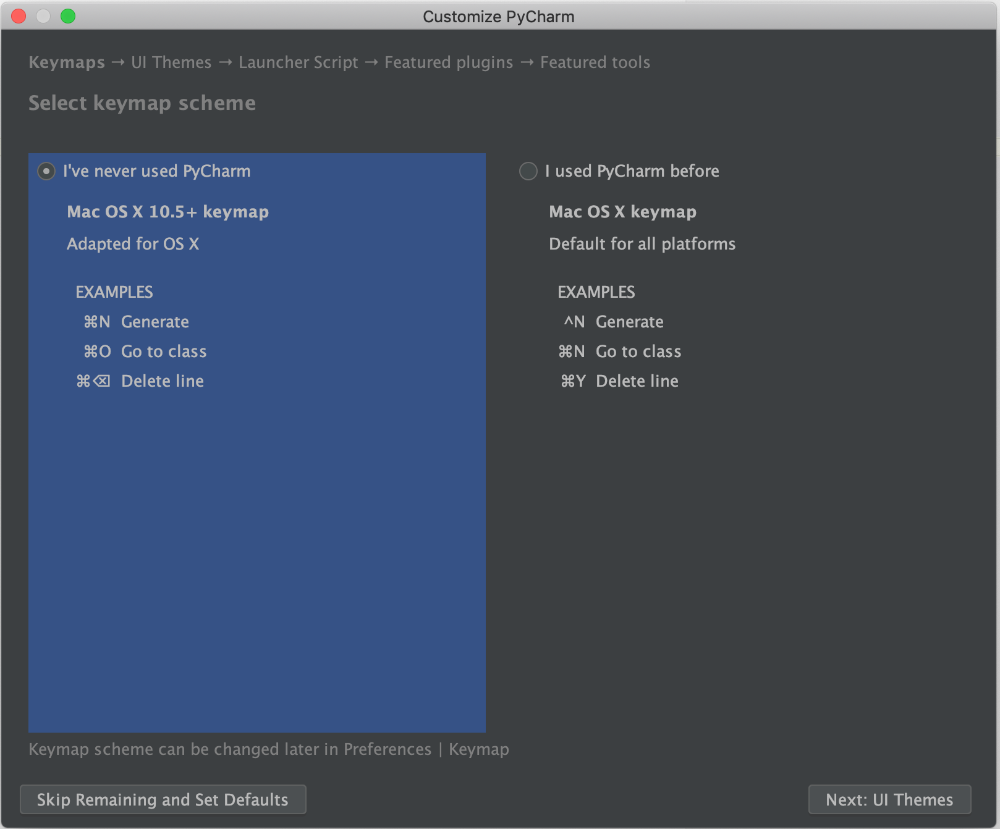
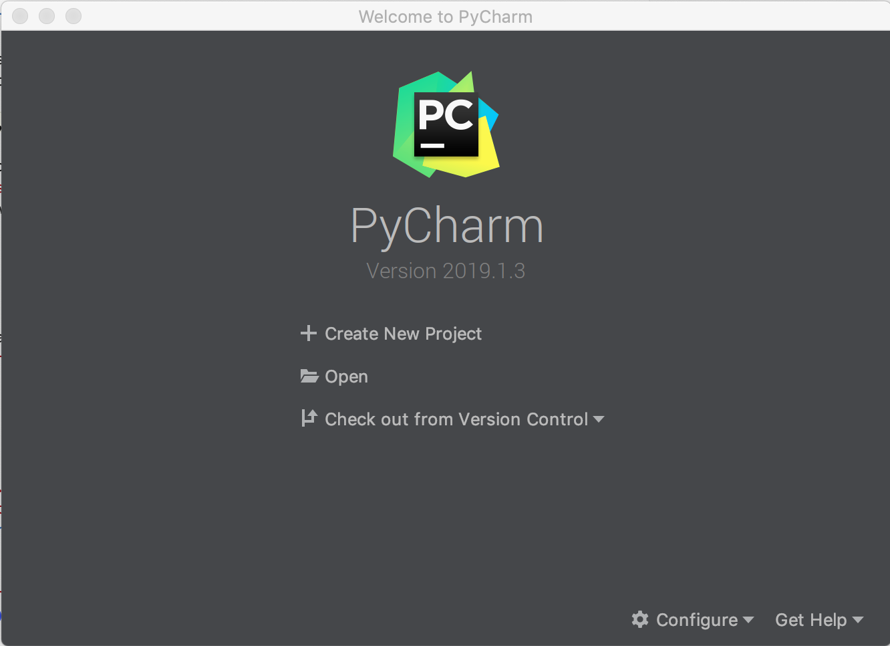
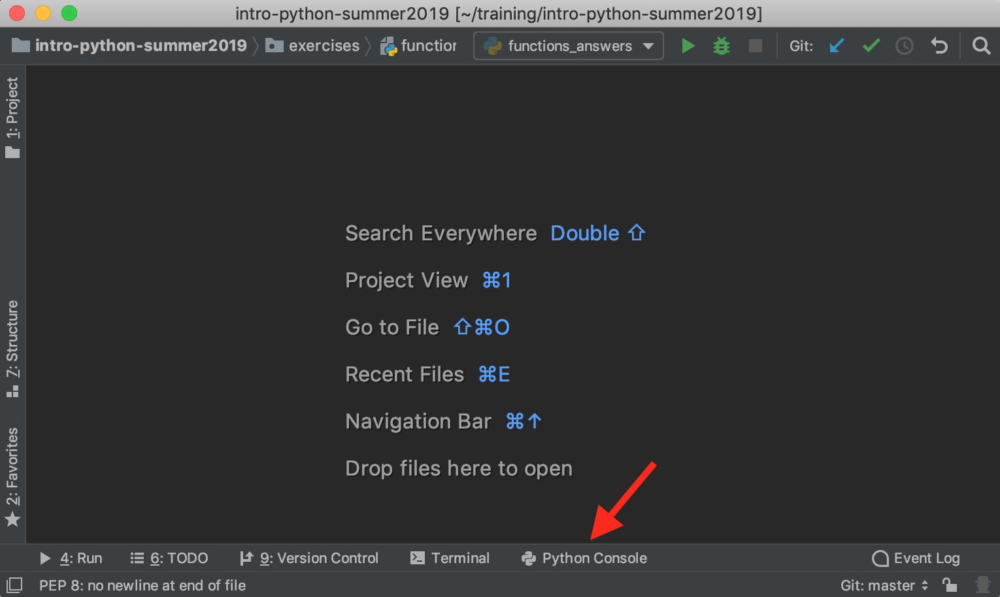
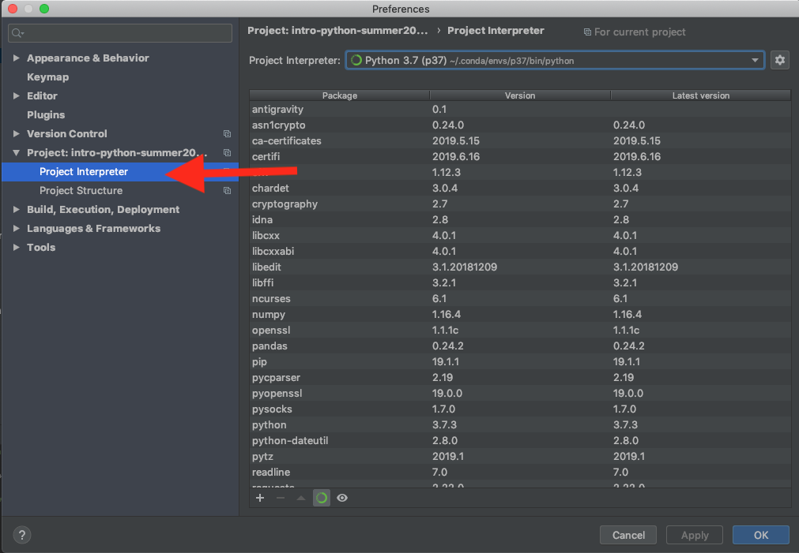

# PyCharm Setup

When you open PyCharm, you may be prompted as to whether you want to import settings.  If prompted and you've used PyCharm before, it's your choice what you choose.  If you have not used PyCharm, you can choose not to import anything.

The next screen that may come up is about preferences.  Here's what it looked like on my Mac:



You can choose the bottom left option to "Skip Remaining and Set Defaults."

Next, you'll see the window that will normally come up when opening PyCharm:



Choose Open and then navigate to the folder where you downloaded the files from this repository (likely called intro-python-summer2019-master in your Downloads folder or wherever else you moved it).

# PyCharm Python Version

To see what version of Python is associated with the project you have open (what version of Python will be used to run your code), open the Python Console from the link at the bottom of the window, or from the top menu, View > Tool Windows > Python Console.



In the console that opens, at the `>>>` prompt, type 

```python
import sys
sys.version
```

If it's not Python 3.7 (or at least Python 3.5 or 3.6), we're going to change the Python Interpreter associated with this project.

From the top menu, open PyCharm > Preferences.



Then expand the Project menu on the left and choose Project Interpreter.  Note that the contents of your window will look different from mine, but the menu options will be the same.  

From the pull down Project Interpreter menu in the main part of the window, look for an option that says Python 3.7.  If you don't see one, choose "Show All" and see if there's one there.  If not, ask for help. 