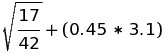

These are during-workshop exercises that correspond to the [first Python script](python-script1.md) file.


## Calculator and Variables


Use Python to find the answer:



Save the answer to a variable called `result`.  Display the value of `result`.

Increment the value of `result` by 5.

Test if `result` is greater than or equal to 10 (get a `True` or `False` value as output).


## Strings

* Create variables `firstname` and `lastname` and give them the appropriate values for your name.  
* Join the variables together with a space in-between and save that in a variable called `fullname`.  
* `print()` your full name.  
* Then print your full name converted to all upper case.  
* How many letters are in your name?  
* Bonus: Replace all of the lowercase vowels in your name with `*`.


Done with the above?  Create a variable with the text of Margaret Atwood's poem "You Fit Into Me" with line breaks and empty lines included:

```
you fit into me
like a hook into an eye

a fish hook
an open eye
```

## String Formatting

Create variables `firstname` and `lastname` (or you may still have them defined from above).  Insert them into a sentence that will read "My name is **firstname lastname**" (with the values of the variables) using the string `format()` function.


## Lists

Make a list with 3 of your favorite words.  Referencing each word using its index, print the following sentence with each word inserted in turn: "One of my favorite words is \_\_\_."  (Hint: remember how to concatenate or format strings?)

Replace the middle element of the list with a new word.

Use `in` to test if 'flamingo' is in your list.

Add two words to the end of your list, then print it out.

#### Challenge

Add two words to the *beginning* of your list, then print it out.

Now remove the words you added to your list, and print it out again.  See https://stackoverflow.com/questions/11520492/difference-between-del-remove-and-pop-on-lists for options on removing values from a list.


## String Indexing

Start with the variable `sentence` as defined below.

```python
sentence = "The quick brown fox jumped over the lazy dog."
```

* Get the first 10 characters of `sentence`
* Get the substring of `sentence` corresponding to "dog"

### Nested lists

You can have nested lists. Create a list that has two other lists as its
elements. Save it in a variable called `nested_list`.

Print the first list from `nested_list`. Then print the second element of the
first list.


## Lists: Fixing Syntax Errors

Fix the errors in the code below.

```
2010data = [3, 5, 7, 9, 11]
print("The first 2010 data value is " + 2010data[0])

mycolors = ["red", "green", "blue", ["purple", "pink", "teal"]]
# make the sentence below make sense with values from mycolors above
print(mycolors[1] + " and "mycolors[3] + " mix to make " + mycolors[4]) 

my_list=["apples", "bananas", "pears]
print(mylist)
# add avocado to the list
my_list + "avocado"
print(my_list)
```


## Dictionaries

Make a dictionary with keys being types of animals and values being their class (invertebrate, mammal, bird, amphibian, reptile, or fish).  Stuck thinking of animals?  Use: dog, cat, frog, snake, salamander.

Get the class of two of the animals you added.  Get the class of 'flamingo' using `get()`, with a default value of 'unknown'.

Now, add a new animal to your dictionary.

Get all of the keys in the dictionary.


### Challenge: Dictionary troubleshooting

Run the following code, which produces an error:

```python
ages = {'Casey': 41, 'Henry': 4, 'Madison': 2, 'Caroline': 0, 'Brian': 36}
ages.keys()[0]
```

Google the last line of the error to find a solution.  Ask for help if you need.


### Challenge: Dictionary of dictionaries

Run the following code.  Then write an expression to get the the age of patient 'a49283'.

```python
patients = {'a38275': {'age': 42, 'admitted': '2019-01-03', 'test': False},
            'a49283': {'age': 45, 'admitted': '2019-02-01', 'test': True},
            'a92042': {'age': 34, 'admitted': '2019-01-10', 'test': True}}
```


